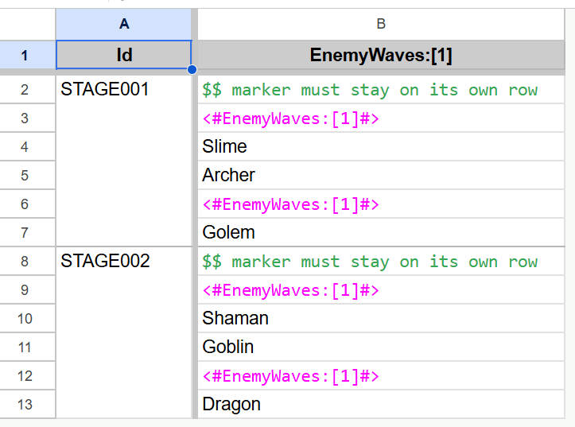
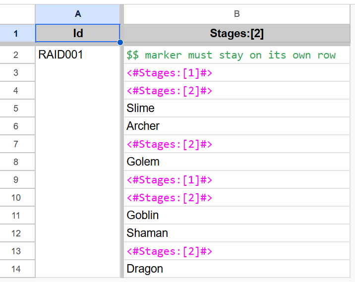
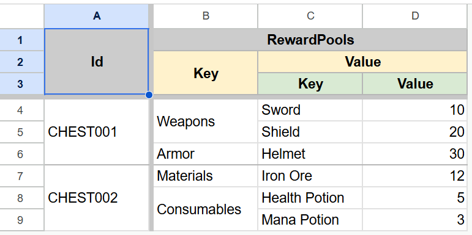
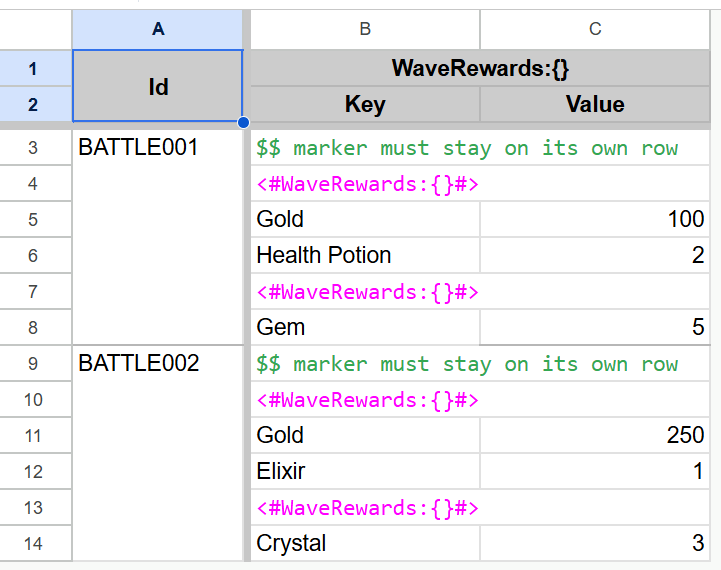
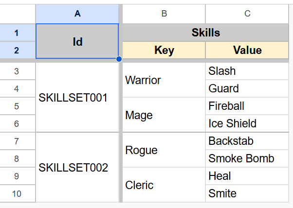
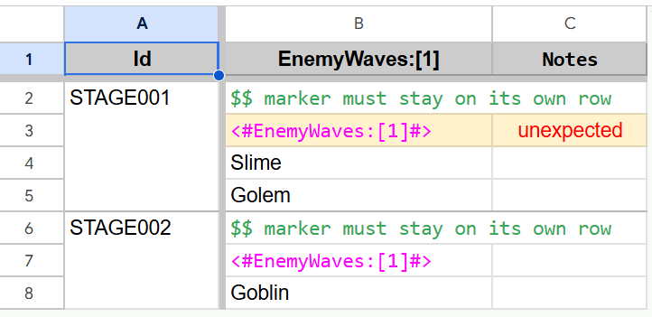
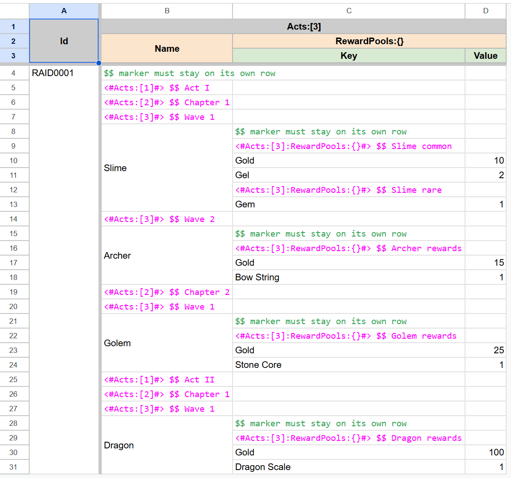

# Nested Collections
BakingSheet supports vertical lists and vertical dictionaries nested inside other vertical collections. This guide
expands on [Using Vertical Dictionary](../README.md#using-vertical-dictionary) and
[Using Nested Vertical List](../README.md#using-nested-vertical-list).

> [!NOTE]
> Each screenshot uses Hybrid headers. The Markdown versions are ordered Flat, Split, then Hybrid.
> When Flat and Hybrid produce the same physical header geometry, one `Flat/Hybrid header` version represents both modes.

## List in List

A vertical list can contain other vertical lists to organize values into multiple ordered groups.



```csharp
public VerticalList<VerticalList<string>> EnemyWaves { get; private set; }
```

<details>
<summary>Flat/Hybrid header</summary>

| Id       | EnemyWaves:[1]                       |
| -------- | ------------------------------------ |
| STAGE001 | `$$ marker must stay on its own row` |
|          | `<#EnemyWaves:[1]#>`                 |
|          | Slime                                |
|          | Archer                               |
|          | `<#EnemyWaves:[1]#>`                 |
|          | Golem                                |
| STAGE002 | `$$ marker must stay on its own row` |
|          | `<#EnemyWaves:[1]#>`                 |
|          | Shaman                               |
|          | Goblin                               |
|          | `<#EnemyWaves:[1]#>`                 |
|          | Dragon                               |
</details>

<details>
<summary>Split header</summary>

| Id       | EnemyWaves                           |
| -------- | ------------------------------------ |
|          | `[]`                                 |
| STAGE001 | `$$ marker must stay on its own row` |
|          | `<#EnemyWaves:[1]#>`                 |
|          | Slime                                |
|          | Archer                               |
|          | `<#EnemyWaves:[1]#>`                 |
|          | Golem                                |
| STAGE002 | `$$ marker must stay on its own row` |
|          | `<#EnemyWaves:[1]#>`                 |
|          | Shaman                               |
|          | Goblin                               |
|          | `<#EnemyWaves:[1]#>`                 |
|          | Dragon                               |
</details>

`EnemyWaves:[1]` declares one anonymous list inside the named outer `EnemyWaves` list. Every inner wave list begins
with an explicit `<#EnemyWaves:[1]#>` marker, including the first. The marker appears in the `EnemyWaves:[1]` column,
and every other cell in its row is blank.

The tables above show two stages, each containing two waves of enemies:
- `STAGE001` contains 2 lists:
    - The first list contains `Slime` and `Archer`.
    - The second list contains `Golem`.
- `STAGE002` contains 2 lists:
    - The first contains `Shaman` and `Goblin`.
    - The second contains `Dragon`.

## Multi-Level List Nesting

Vertical lists can be nested across three or more levels, with markers beginning lists at each anonymous depth.



```csharp
public VerticalList<VerticalList<VerticalList<string>>> Stages { get; private set; }
```

<details>
<summary>Flat/Hybrid header</summary>

| Id      | Stages:[2]                           |
| ------- | ------------------------------------ |
| RAID001 | `$$ marker must stay on its own row` |
|         | `<#Stages:[1]#>`                     |
|         | `<#Stages:[2]#>`                     |
|         | Slime                                |
|         | Archer                               |
|         | `<#Stages:[2]#>`                     |
|         | Golem                                |
|         | `<#Stages:[1]#>`                     |
|         | `<#Stages:[2]#>`                     |
|         | Goblin                               |
|         | Shaman                               |
|         | `<#Stages:[2]#>`                     |
|         | Dragon                               |
</details>

<details>
<summary>Split header</summary>

| Id      | Stages                               |
| ------- | ------------------------------------ |
|         | `[]`                                 |
|         | `[]`                                 |
| RAID001 | `$$ marker must stay on its own row` |
|         | `<#Stages:[1]#>`                     |
|         | `<#Stages:[2]#>`                     |
|         | Slime                                |
|         | Archer                               |
|         | `<#Stages:[2]#>`                     |
|         | Golem                                |
|         | `<#Stages:[1]#>`                     |
|         | `<#Stages:[2]#>`                     |
|         | Goblin                               |
|         | Shaman                               |
|         | `<#Stages:[2]#>`                     |
|         | Dragon                               |
</details>

`Stages` is the named outermost list which contains stage lists. Each stage list contains wave lists, and each wave
list contains enemy entries. The header `Stages:[2]` declares the two anonymous list components after the named outer
list.

`<#Stages:[1]#>` begins a stage list, while `<#Stages:[2]#>` begins a wave list within the current stage list. Every
stage and wave list begins with its marker, including the first. Each marker occupies the `Stages:[2]` column by itself;
every other cell in its row is blank. The markers are not entries; the enemy names are the entries stored by the
innermost lists.

<details>
<summary><code>RAID001</code> list structure</summary>

```text
Stages
├─ Stage list 1  // <#Stages:[1]#>
│  ├─ Wave list 1  // <#Stages:[2]#>
│  │  ├─ Slime
│  │  └─ Archer
│  └─ Wave list 2  // <#Stages:[2]#>
│     └─ Golem
└─ Stage list 2  // <#Stages:[1]#>
   ├─ Wave list 1  // <#Stages:[2]#>
   │  ├─ Goblin
   │  └─ Shaman
   └─ Wave list 2  // <#Stages:[2]#>
      └─ Dragon
```
</details>

The tables above show one raid containing two stage lists. Each stage list contains two wave lists:
- `RAID001` contains 2 stage lists:
    - The first stage list contains 2 wave lists:
        - The first wave list contains `Slime` and `Archer`.
        - The second wave list contains `Golem`.
    - The second stage list contains 2 wave lists:
        - The first wave list contains `Goblin` and `Shaman`.
        - The second wave list contains `Dragon`.

## Dictionary in Dictionary

A vertical dictionary can contain other vertical dictionaries, allowing key-based data to span multiple levels.



```csharp
public VerticalDictionary<string, VerticalDictionary<string, int>> RewardPools { get; private set; }
```

<details>
<summary>Flat header</summary>

| Id       | RewardPools:Key | RewardPools:Value:Key | RewardPools:Value:Value |
|----------|-----------------|-----------------------|-------------------------|
| CHEST001 | Weapons         | Sword                 | 10                      |
|          |                 | Shield                | 20                      |
|          | Armor           | Helmet                | 30                      |
| CHEST002 | Materials       | Iron Ore              | 12                      |
|          | Consumables     | Health Potion         | 5                       |
|          |                 | Mana Potion           | 3                       |
</details>

<details>
<summary>Split header</summary>

| Id       | RewardPools |               |       |
|----------|-------------|---------------|-------|
|          | Key         | Value         |       |
|          |             | Key           | Value |
| CHEST001 | Weapons     | Sword         | 10    |
|          |             | Shield        | 20    |
|          | Armor       | Helmet        | 30    |
| CHEST002 | Materials   | Iron Ore      | 12    |
|          | Consumables | Health Potion | 5     |
|          |             | Mana Potion   | 3     |
</details>

<details>
<summary>Hybrid header</summary>

| Id       | RewardPools |               |       |
|----------|-------------|---------------|-------|
|          | Key         | Value         |       |
|          |             | Key           | Value |
| CHEST001 | Weapons     | Sword         | 10    |
|          |             | Shield        | 20    |
|          | Armor       | Helmet        | 30    |
| CHEST002 | Materials   | Iron Ore      | 12    |
|          | Consumables | Health Potion | 5     |
|          |             | Mana Potion   | 3     |
</details>

The tables above show two chests, each containing two reward groups:
- `CHEST001` contains 2 groups:
    - `Weapons` contains `Sword: 10` and `Shield: 20`.
    - `Armor` contains `Helmet: 30`.
- `CHEST002` contains 2 groups:
    - `Materials` contains `Iron Ore: 12`.
    - `Consumables` contains `Health Potion: 5` and `Mana Potion: 3`.

## Dictionary in List

A vertical list can contain vertical dictionaries, combining ordered groups with key-based values in each group.



```csharp
public VerticalList<VerticalDictionary<string, int>> WaveRewards { get; private set; }
```

<details>
<summary>Flat header</summary>

| Id        | WaveRewards:{}:Key                   | WaveRewards:{}:Value |
| --------- | ------------------------------------ | -------------------- |
| BATTLE001 | `$$ marker must stay on its own row` |                      |
|           | `<#WaveRewards:{}#>`                 |                      |
|           | Gold                                 | 100                  |
|           | Health Potion                        | 2                    |
|           | `<#WaveRewards:{}#>`                 |                      |
|           | Gem                                  | 5                    |
| BATTLE002 | `$$ marker must stay on its own row` |                      |
|           | `<#WaveRewards:{}#>`                 |                      |
|           | Gold                                 | 250                  |
|           | Elixir                               | 1                    |
|           | `<#WaveRewards:{}#>`                 |                      |
|           | Crystal                              | 3                    |
</details>

<details>
<summary>Split header</summary>

| Id        | WaveRewards                          |       |
| --------- | ------------------------------------ | ----- |
|           | `{}`                                 |       |
|           | Key                                  | Value |
| BATTLE001 | `$$ marker must stay on its own row` |       |
|           | `<#WaveRewards:{}#>`                 |       |
|           | Gold                                 | 100   |
|           | Health Potion                        | 2     |
|           | `<#WaveRewards:{}#>`                 |       |
|           | Gem                                  | 5     |
| BATTLE002 | `$$ marker must stay on its own row` |       |
|           | `<#WaveRewards:{}#>`                 |       |
|           | Gold                                 | 250   |
|           | Elixir                               | 1     |
|           | `<#WaveRewards:{}#>`                 |       |
|           | Crystal                              | 3     |
</details>

<details>
<summary>Hybrid header</summary>

| Id        | WaveRewards:{}                       |       |
| --------- | ------------------------------------ | ----- |
|           | Key                                  | Value |
| BATTLE001 | `$$ marker must stay on its own row` |       |
|           | `<#WaveRewards:{}#>`                 |       |
|           | Gold                                 | 100   |
|           | Health Potion                        | 2     |
|           | `<#WaveRewards:{}#>`                 |       |
|           | Gem                                  | 5     |
| BATTLE002 | `$$ marker must stay on its own row` |       |
|           | `<#WaveRewards:{}#>`                 |       |
|           | Gold                                 | 250   |
|           | Elixir                               | 1     |
|           | `<#WaveRewards:{}#>`                 |       |
|           | Crystal                              | 3     |
</details>

`{}` identifies the anonymous dictionary contained by `WaveRewards`. Every dictionary instance begins with an explicit
`<#WaveRewards:{}#>` marker, including the first. The marker appears in the leftmost column owned by `WaveRewards`,
with every other cell in the marker row left blank. It begins a dictionary instance; the following nonblank keys begin
entries inside that instance.

The tables above show two battles, each containing two reward dictionaries:
- `BATTLE001` contains 2 dictionaries:
    - The first dictionary contains `100 Gold` and `2 Health Potions`.
    - The second dictionary contains `5 Gems`.
- `BATTLE002` contains 2 dictionaries:
    - The first dictionary contains `250 Gold` and `1 Elixir`.
    - The second dictionary contains `3 Crystals`.

## List in Dictionary

A vertical dictionary can contain vertical lists, giving each key its own ordered sequence of values.



```csharp
public VerticalDictionary<string, VerticalList<string>> Skills { get; private set; }
```

<details>
<summary>Flat header</summary>

| Id          | Skills:Key | Skills:Value |
|-------------|------------|--------------|
| SKILLSET001 | Warrior    | Slash        |
|             |            | Guard        |
|             | Mage       | Fireball     |
|             |            | Ice Shield   |
| SKILLSET002 | Rogue      | Backstab     |
|             |            | Smoke Bomb   |
|             | Cleric     | Heal         |
|             |            | Smite        |
</details>

<details>
<summary>Split header</summary>

| Id          | Skills  |            |
|-------------|---------|------------|
|             | Key     | Value      |
| SKILLSET001 | Warrior | Slash      |
|             |         | Guard      |
|             | Mage    | Fireball   |
|             |         | Ice Shield |
| SKILLSET002 | Rogue   | Backstab   |
|             |         | Smoke Bomb |
|             | Cleric  | Heal       |
|             |         | Smite      |
</details>

<details>
<summary>Hybrid header</summary>

| Id          | Skills  |            |
|-------------|---------|------------|
|             | Key     | Value      |
| SKILLSET001 | Warrior | Slash      |
|             |         | Guard      |
|             | Mage    | Fireball   |
|             |         | Ice Shield |
| SKILLSET002 | Rogue   | Backstab   |
|             |         | Smoke Bomb |
|             | Cleric  | Heal       |
|             |         | Smite      |
</details>

The `Warrior`, `Mage`, `Rogue`, and `Cleric` keys separate the vertical lists stored as dictionary values, so no marker
is needed.

The tables above show two skill sets, each containing two class lists:
- `SKILLSET001` contains 2 lists:
    - The `Warrior` list contains `Slash` and `Guard`.
    - The `Mage` list contains `Fireball` and `Ice Shield`.
- `SKILLSET002` contains 2 lists:
    - The `Rogue` list contains `Backstab` and `Smoke Bomb`.
    - The `Cleric` list contains `Heal` and `Smite`.

## Invalid Markers

BakingSheet validates marker syntax, target paths, and marker-row contents before applying a collection boundary.

A valid marker must use the complete `<#collection_path#>` syntax, end in a one-based anonymous-list selector or `{}`,
target a known anonymous collection, and appear after the headers while a logical row is active. A marker row must
contain exactly one marker, with every other cell left blank.



<details>
<summary>Flat/Hybrid header</summary>

| Id       | EnemyWaves:[1]                       | Notes      |
| -------- | ------------------------------------ | ---------- |
| STAGE001 | `$$ marker must stay on its own row` |            |
|          | `<#EnemyWaves:[1]#>`                 | unexpected |
|          | Slime                                |            |
|          | Golem                                |            |
| STAGE002 | `$$ marker must stay on its own row` |            |
|          | `<#EnemyWaves:[1]#>`                 |            |
|          | Goblin                               |            |
</details>

<details>
<summary>Split header</summary>

| Id       | EnemyWaves                           | Notes      |
| -------- | ------------------------------------ | ---------- |
|          | `[]`                                 |            |
| STAGE001 | `$$ marker must stay on its own row` |            |
|          | `<#EnemyWaves:[1]#>`                 | unexpected |
|          | Slime                                |            |
|          | Golem                                |            |
| STAGE002 | `$$ marker must stay on its own row` |            |
|          | `<#EnemyWaves:[1]#>`                 |            |
|          | Goblin                               |            |
</details>

The table above shows how BakingSheet handles an invalid marker row:
- `STAGE001` begins with an invalid marker row because `Notes` contains `unexpected` instead of being blank.
- BakingSheet rejects `STAGE001` and its continuation rows containing `Slime` and `Golem`.
- Import resumes at the next nonblank `Id`, which is `STAGE002`.
- The valid marker then begins `STAGE002`'s first nested list, which contains `Goblin`.

## Complete Example

This example models `RAID0001` as Acts → Chapters → Waves → Enemies. Each enemy also owns a vertical list of reward
dictionaries, allowing separate common and rare reward pools.



```csharp
public VerticalList<VerticalList<VerticalList<VerticalList<RaidEnemy>>>> Acts { get; private set; }

public sealed class RaidEnemy
{
    public string Name { get; private set; }
    public VerticalList<VerticalDictionary<string, int>> RewardPools { get; private set; }
}
```

- The list named `Acts` contains three anonymous list levels:
    - Marker `[1]` begins an Act
    - Marker `[2]` begins a Chapter
    - Marker `[3]` begins a Wave
- A non-blank enemy `Name` begins an enemy entry inside the active Wave.
- `<#Acts:[3]:RewardPools:{}#>` begins a reward dictionary for the current enemy.
- A non-blank reward `Key` begins an entry inside that dictionary.

### Object Structure

```text
Acts
├─ Act I                                      // <#Acts:[1]#>
│  ├─ Chapter 1                               // <#Acts:[2]#>
│  │  ├─ Wave 1                               // <#Acts:[3]#>
│  │  │  └─ Slime
│  │  │     ├─ Reward dictionary 1            // <#Acts:[3]:RewardPools:{}#>
│  │  │     │  ├─ Gold: 10
│  │  │     │  └─ Gel: 2
│  │  │     └─ Reward dictionary 2            // <#Acts:[3]:RewardPools:{}#>
│  │  │        └─ Gem: 1
│  │  └─ Wave 2                               // <#Acts:[3]#>
│  │     └─ Archer
│  │        └─ Reward dictionary
│  │           ├─ Gold: 15
│  │           └─ Bow String: 1
│  └─ Chapter 2                               // <#Acts:[2]#>
│     └─ Wave 1                               // <#Acts:[3]#>
│        └─ Golem
│           └─ Reward dictionary
│              ├─ Gold: 25
│              └─ Stone Core: 1
└─ Act II                                     // <#Acts:[1]#>
   └─ Chapter 1                               // <#Acts:[2]#>
      └─ Wave 1                               // <#Acts:[3]#>
         └─ Dragon
            └─ Reward dictionary
               ├─ Gold: 100
               └─ Dragon Scale: 1
```

### Markdown Representation

<details>
<summary>Flat header</summary>

| Id       | Acts:[3]:Name                        | Acts:[3]:RewardPools:{}:Key                     | Acts:[3]:RewardPools:{}:Value |
| -------- | ------------------------------------ | ----------------------------------------------- | ----------------------------- |
| RAID0001 | `$$ marker must stay on its own row` |                                                 |                               |
|          | `<#Acts:[1]#> $$ Act I`              |                                                 |                               |
|          | `<#Acts:[2]#> $$ Chapter 1`          |                                                 |                               |
|          | `<#Acts:[3]#> $$ Wave 1`             |                                                 |                               |
|          | Slime                                | `$$ marker must stay on its own row`            |                               |
|          |                                      | `<#Acts:[3]:RewardPools:{}#> $$ Slime common`   |                               |
|          |                                      | Gold                                            | 10                            |
|          |                                      | Gel                                             | 2                             |
|          |                                      | `<#Acts:[3]:RewardPools:{}#> $$ Slime rare`     |                               |
|          |                                      | Gem                                             | 1                             |
|          | `<#Acts:[3]#> $$ Wave 2`             |                                                 |                               |
|          | Archer                               | `$$ marker must stay on its own row`            |                               |
|          |                                      | `<#Acts:[3]:RewardPools:{}#> $$ Archer rewards` |                               |
|          |                                      | Gold                                            | 15                            |
|          |                                      | Bow String                                      | 1                             |
|          | `<#Acts:[2]#> $$ Chapter 2`          |                                                 |                               |
|          | `<#Acts:[3]#> $$ Wave 1`             |                                                 |                               |
|          | Golem                                | `$$ marker must stay on its own row`            |                               |
|          |                                      | `<#Acts:[3]:RewardPools:{}#> $$ Golem rewards`  |                               |
|          |                                      | Gold                                            | 25                            |
|          |                                      | Stone Core                                      | 1                             |
|          | `<#Acts:[1]#> $$ Act II`             |                                                 |                               |
|          | `<#Acts:[2]#> $$ Chapter 1`          |                                                 |                               |
|          | `<#Acts:[3]#> $$ Wave 1`             |                                                 |                               |
|          | Dragon                               | `$$ marker must stay on its own row`            |                               |
|          |                                      | `<#Acts:[3]:RewardPools:{}#> $$ Dragon rewards` |                               |
|          |                                      | Gold                                            | 100                           |
|          |                                      | Dragon Scale                                    | 1                             |
</details>

<details>
<summary>Split header</summary>

| Id       | Acts                                 |                                                 |       |
| -------- | ------------------------------------ | ----------------------------------------------- | ----- |
|          | `[]`                                 |                                                 |       |
|          | `[]`                                 |                                                 |       |
|          | `[]`                                 |                                                 |       |
|          | Name                                 | RewardPools                                     |       |
|          |                                      | `{}`                                            |       |
|          |                                      | Key                                             | Value |
| RAID0001 | `$$ marker must stay on its own row` |                                                 |       |
|          | `<#Acts:[1]#> $$ Act I`              |                                                 |       |
|          | `<#Acts:[2]#> $$ Chapter 1`          |                                                 |       |
|          | `<#Acts:[3]#> $$ Wave 1`             |                                                 |       |
|          | Slime                                | `$$ marker must stay on its own row`            |       |
|          |                                      | `<#Acts:[3]:RewardPools:{}#> $$ Slime common`   |       |
|          |                                      | Gold                                            | 10    |
|          |                                      | Gel                                             | 2     |
|          |                                      | `<#Acts:[3]:RewardPools:{}#> $$ Slime rare`     |       |
|          |                                      | Gem                                             | 1     |
|          | `<#Acts:[3]#> $$ Wave 2`             |                                                 |       |
|          | Archer                               | `$$ marker must stay on its own row`            |       |
|          |                                      | `<#Acts:[3]:RewardPools:{}#> $$ Archer rewards` |       |
|          |                                      | Gold                                            | 15    |
|          |                                      | Bow String                                      | 1     |
|          | `<#Acts:[2]#> $$ Chapter 2`          |                                                 |       |
|          | `<#Acts:[3]#> $$ Wave 1`             |                                                 |       |
|          | Golem                                | `$$ marker must stay on its own row`            |       |
|          |                                      | `<#Acts:[3]:RewardPools:{}#> $$ Golem rewards`  |       |
|          |                                      | Gold                                            | 25    |
|          |                                      | Stone Core                                      | 1     |
|          | `<#Acts:[1]#> $$ Act II`             |                                                 |       |
|          | `<#Acts:[2]#> $$ Chapter 1`          |                                                 |       |
|          | `<#Acts:[3]#> $$ Wave 1`             |                                                 |       |
|          | Dragon                               | `$$ marker must stay on its own row`            |       |
|          |                                      | `<#Acts:[3]:RewardPools:{}#> $$ Dragon rewards` |       |
|          |                                      | Gold                                            | 100   |
|          |                                      | Dragon Scale                                    | 1     |
</details>

<details>
<summary>Hybrid header</summary>

| Id       | Acts:[3]                             |                                                 |       |
| -------- | ------------------------------------ | ----------------------------------------------- | ----- |
|          | Name                                 | RewardPools:{}                                  |       |
|          |                                      | Key                                             | Value |
| RAID0001 | `$$ marker must stay on its own row` |                                                 |       |
|          | `<#Acts:[1]#> $$ Act I`              |                                                 |       |
|          | `<#Acts:[2]#> $$ Chapter 1`          |                                                 |       |
|          | `<#Acts:[3]#> $$ Wave 1`             |                                                 |       |
|          | Slime                                | `$$ marker must stay on its own row`            |       |
|          |                                      | `<#Acts:[3]:RewardPools:{}#> $$ Slime common`   |       |
|          |                                      | Gold                                            | 10    |
|          |                                      | Gel                                             | 2     |
|          |                                      | `<#Acts:[3]:RewardPools:{}#> $$ Slime rare`     |       |
|          |                                      | Gem                                             | 1     |
|          | `<#Acts:[3]#> $$ Wave 2`             |                                                 |       |
|          | Archer                               | `$$ marker must stay on its own row`            |       |
|          |                                      | `<#Acts:[3]:RewardPools:{}#> $$ Archer rewards` |       |
|          |                                      | Gold                                            | 15    |
|          |                                      | Bow String                                      | 1     |
|          | `<#Acts:[2]#> $$ Chapter 2`          |                                                 |       |
|          | `<#Acts:[3]#> $$ Wave 1`             |                                                 |       |
|          | Golem                                | `$$ marker must stay on its own row`            |       |
|          |                                      | `<#Acts:[3]:RewardPools:{}#> $$ Golem rewards`  |       |
|          |                                      | Gold                                            | 25    |
|          |                                      | Stone Core                                      | 1     |
|          | `<#Acts:[1]#> $$ Act II`             |                                                 |       |
|          | `<#Acts:[2]#> $$ Chapter 1`          |                                                 |       |
|          | `<#Acts:[3]#> $$ Wave 1`             |                                                 |       |
|          | Dragon                               | `$$ marker must stay on its own row`            |       |
|          |                                      | `<#Acts:[3]:RewardPools:{}#> $$ Dragon rewards` |       |
|          |                                      | Gold                                            | 100   |
|          |                                      | Dragon Scale                                    | 1     |
</details>
