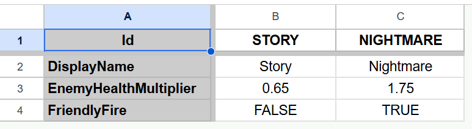
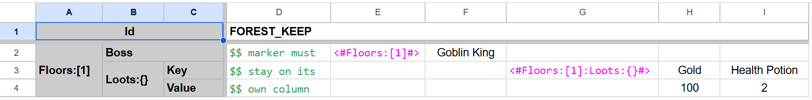

# Advanced Sheet Transposition

Sheet transposition places records across columns while their properties run down rows. It is useful when a small set
of records is easier to compare side by side.

## Rules

- Apply `[Transpose]` to a sheet property on `SheetContainerBase`.
- During import, BakingSheet reads source columns as sheet rows.
- During export, BakingSheet writes sheet rows back as source columns.
- Excel, Google Sheet, and comma-separated value converters support transposition.
- JavaScript Object Notation conversion does not use this row-and-column layout.
- Use different sheet types when one container needs both normal and transposed layouts.

## Multiple Records

The following example stores two difficulty presets in one sheet. Each preset becomes a
`DifficultyPresetSheet.Row`.



<details>
<summary>Markdown version</summary>

Before transposition:

| Id                    | STORY | NIGHTMARE |
|-----------------------|-------|-----------|
| DisplayName           | Story | Nightmare |
| EnemyHealthMultiplier | 0.65  | 1.75      |
| FriendlyFire          | FALSE | TRUE      |

After transposition:

| Id        | DisplayName | EnemyHealthMultiplier | FriendlyFire |
|-----------|-------------|-----------------------|--------------|
| STORY     | Story       | 0.65                  | FALSE        |
| NIGHTMARE | Nightmare   | 1.75                  | TRUE         |

</details>

```csharp
public class DifficultyPresetSheet : Sheet<DifficultyPresetSheet.Row>
{
    public class Row : SheetRow
    {
        public string DisplayName { get; private set; }
        public float EnemyHealthMultiplier { get; private set; }
        public bool FriendlyFire { get; private set; }
    }
}

public class SheetContainer : SheetContainerBase
{
    public SheetContainer(Microsoft.Extensions.Logging.ILogger logger) : base(logger) {}

    [Transpose]
    public DifficultyPresetSheet DifficultyPresets { get; private set; }
}
```

## Complex Records

A transposed record can contain lists, objects, and dictionaries.

> [!NOTE]
> This layout is difficult to understand, use it only when an ordinary sheet layout cannot represent the data better.



<details>
<summary>Flat version</summary>

Before transposition:

| Id                        | FOREST_KEEP      |                  |             |                           |      |               |
|---------------------------|------------------|------------------|-------------|---------------------------|------|---------------|
| Floors:[1]:Boss           | `$$ marker must` | `<#Floors:[1]#>` | Goblin King |                           |      |               |
| Floors:[1]:Loots:{}:Key   | `$$ stay on its` |                  |             | `<#Floors:[1]:Loots:{}#>` | Gold | Health Potion |
| Floors:[1]:Loots:{}:Value | `$$ own column`  |                  |             |                           | 100  | 2             |

After transposition:

| Id          | Floors:[1]:Boss  | Floors:[1]:Loots:{}:Key   | Floors:[1]:Loots:{}:Value |
|-------------|------------------|---------------------------|---------------------------|
| FOREST_KEEP | `$$ marker must` | `$$ stay on its`          | `$$ own column`           |
|             | `<#Floors:[1]#>` |                           |                           |
|             | Goblin King      |                           |                           |
|             |                  | `<#Floors:[1]:Loots:{}#>` |                           |
|             |                  | Gold                      | 100                       |
|             |                  | Health Potion             | 2                         |

</details>

<details>
<summary>Split version</summary>

Before transposition:

| Id     |      |       |      |       | FOREST_KEEP      |                  |             |                           |      |               |
|--------|------|-------|------|-------|------------------|------------------|-------------|---------------------------|------|---------------|
| Floors | `[]` | Boss  |      |       | `$$ marker must` | `<#Floors:[1]#>` | Goblin King |                           |      |               |
|        |      | Loots | `{}` | Key   | `$$ stay on its` |                  |             | `<#Floors:[1]:Loots:{}#>` | Gold | Health Potion |
|        |      |       |      | Value | `$$ own column`  |                  |             |                           | 100  | 2             |

After transposition:

| Id          | Floors           |                           |                 |
|-------------|------------------|---------------------------|-----------------|
|             | `[]`             |                           |                 |
|             | Boss             | Loots                     |                 |
|             |                  | `{}`                      |                 |
|             |                  | Key                       | Value           |
| FOREST_KEEP | `$$ marker must` | `$$ stay on its`          | `$$ own column` |
|             | `<#Floors:[1]#>` |                           |                 |
|             | Goblin King      |                           |                 |
|             |                  | `<#Floors:[1]:Loots:{}#>` |                 |
|             |                  | Gold                      | 100             |
|             |                  | Health Potion             | 2               |

</details>

<details>
<summary>Hybrid version</summary>

Before transposition:

| Id         |          |       | FOREST_KEEP      |                  |             |                           |      |               |
|------------|----------|-------|------------------|------------------|-------------|---------------------------|------|---------------|
| Floors:[1] | Boss     |       | `$$ marker must` | `<#Floors:[1]#>` | Goblin King |                           |      |               |
|            | Loots:{} | Key   | `$$ stay on its` |                  |             | `<#Floors:[1]:Loots:{}#>` | Gold | Health Potion |
|            |          | Value | `$$ own column`  |                  |             |                           | 100  | 2             |

After transposition:

| Id          | Floors:[1]       |                           |                 |
|-------------|------------------|---------------------------|-----------------|
|             | Boss             | Loots:{}                  |                 |
|             |                  | Key                       | Value           |
| FOREST_KEEP | `$$ marker must` | `$$ stay on its`          | `$$ own column` |
|             | `<#Floors:[1]#>` |                           |                 |
|             | Goblin King      |                           |                 |
|             |                  | `<#Floors:[1]:Loots:{}#>` |                 |
|             |                  | Gold                      | 100             |
|             |                  | Health Potion             | 2               |

</details>

```csharp
public class DungeonSheet : Sheet<DungeonSheet.Row>
{
    public class Room
    {
        public string Boss { get; private set; }
        public VerticalList<VerticalDictionary<string, int>> Loots { get; private set; }
    }

    public class Row : SheetRow
    {
        public VerticalList<VerticalList<Room>> Floors { get; private set; }
    }
}

public class SheetContainer : SheetContainerBase
{
    public SheetContainer(Microsoft.Extensions.Logging.ILogger logger) : base(logger) {}

    [Transpose]
    public DungeonSheet Dungeons { get; private set; }
}
```

Transposition swaps the rows and columns. Each source column becomes one logical row.

Blank `Id` cells continue the `FOREST_KEEP` record.

- `<#Floors:[1]#>` begins the first floor.
- `Goblin King` creates the boss room on that floor.
- `<#Floors:[1]:Loots:{}#>` begins a loot dictionary for the room.
- `Gold` and `Health Potion` become entries in that dictionary.

See [Nested Collections](nested-collections.md) for other ways to combine lists and dictionaries.
